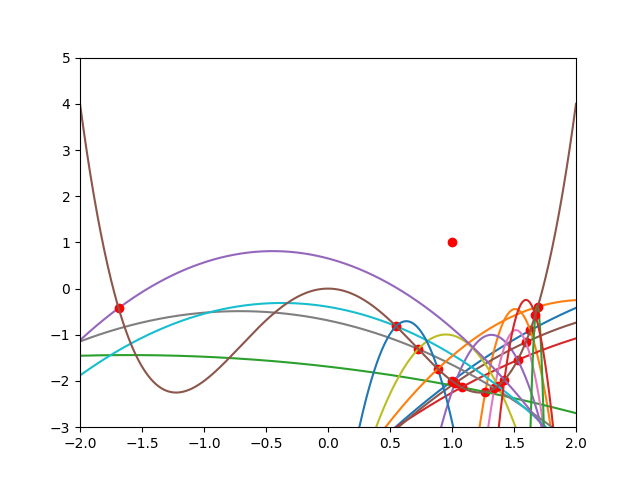
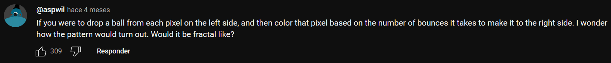

# Balls

## Programa que cálcula bolas rebotando en la función  x^4 - x^2 con la intención de hacer un fractal
### Cada pelota representa un pixel y el color de pixel va en función del número de botes que tarda en llegar al otro lado de la gráfica

#### Aquí se puede ver la simulación de botes de una bola que tiramos desde (1,1)

 

#### Este es el fractal resultante con una calidad de 1000x2000 pixeles

#### Video de zoom a una de sus elipses
https://github.com/Pastafarista/balls/assets/104270259/d648392f-142b-48e7-bb36-b7fa68e2c0f3

#### Zoom más profundo
https://github.com/Pastafarista/balls/assets/104270259/92a09592-7c99-41a4-8a5b-30700793085d

## Inspiración
<a href="https://www.youtube.com/watch?v=LQmyR-sC6GA>">Balls dropped on a double well curve</a> de <a href="https://www.youtube.com/@AlexanderGustafssonAnimations">Alexander Gustafsson</a> 
Comentario de <a href="https://www.youtube.com/channel/UC0Uv9D5C15lCanvxxdo06Ig">Aspwil</a>

## Agradecimientos
<a href="https://github.com/bshoshany/thread-pool">Librería thread-pool de bshoshany</a> 
<a href="https://github.com/ZhepeiWang/Root-Finder">Librería Root-Finder de ZhepeiWang</a>
